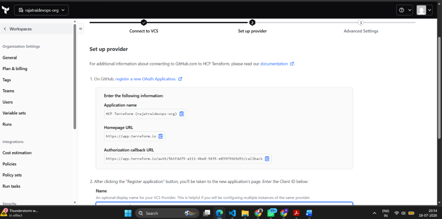
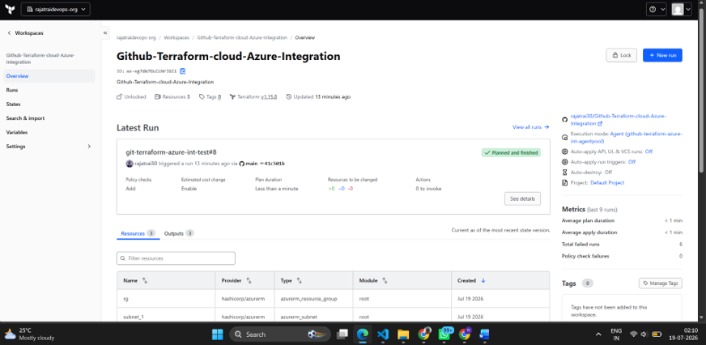
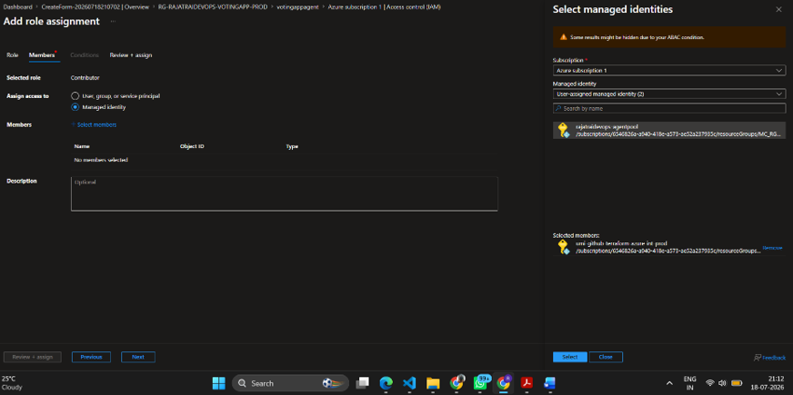
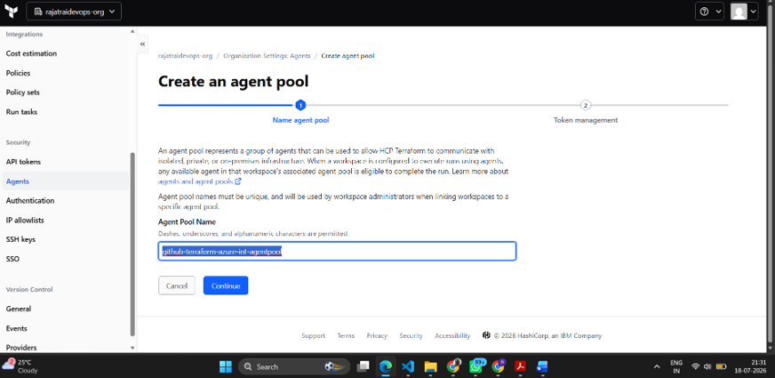
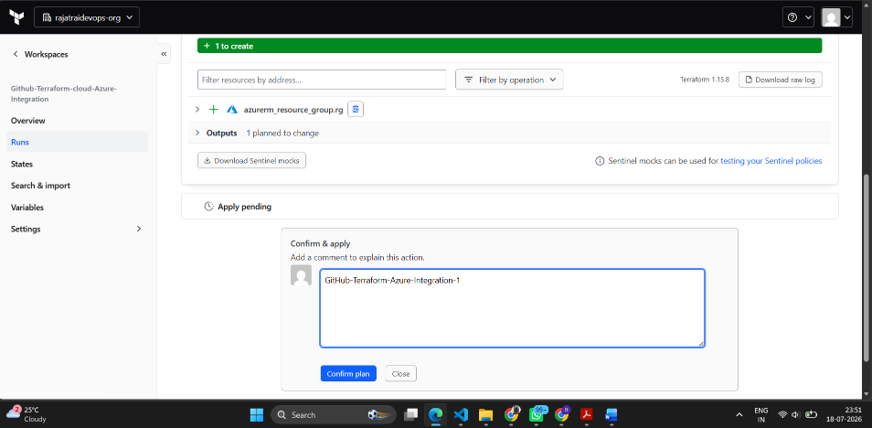
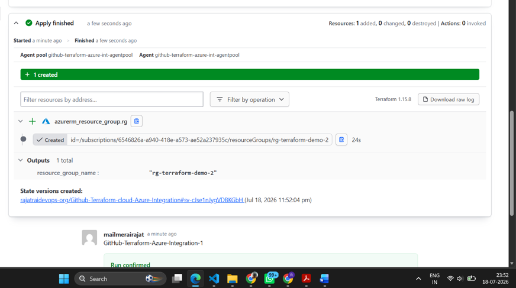
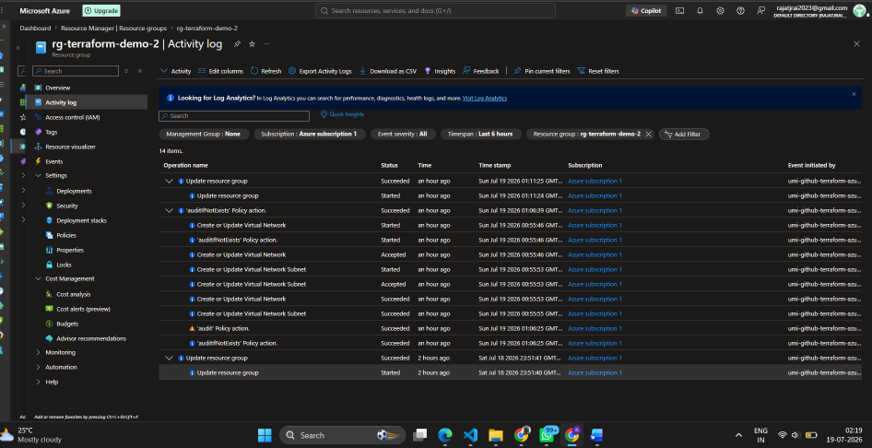

# Enterprise Terraform Cloud Integration with Azure Managed Identity


---

## Overview

This project demonstrates an **enterprise-grade Infrastructure as Code (IaC) platform** by integrating **GitHub**, **Terraform Cloud**, and **Microsoft Azure** using **User Assigned Managed Identity (UAMI)** and **Self-Hosted Terraform Agents**.

Instead of authenticating with Azure using Service Principals or client secrets, Terraform Cloud securely provisions Azure resources through a self-hosted Terraform Agent running on an Azure Linux Virtual Machine authenticated via Azure Managed Identity.

The project also demonstrates secure enterprise deployment patterns including:

- GitHub VCS Integration
- Terraform Cloud Workspaces
- Terraform Agent Pools
- Azure Managed Identity Authentication
- Azure RBAC Authorization
- Multi Subscription Architecture

---

# Architecture

<!-- <p align="center">

</p> -->

```
GitHub Repository
        │
        ▼
Terraform Cloud Workspace
        │
        ▼
Terraform Agent Pool
        │
        ▼
Azure Linux VM
(Self Hosted Terraform Agent)
        │
        ▼
User Assigned Managed Identity
        │
        ▼
Azure RBAC
        │
        ▼
Azure Resources
```

---

# Technology Stack

| Category | Technologies |
|-----------|-------------|
| Cloud | Microsoft Azure |
| Infrastructure as Code | Terraform, Terraform Cloud |
| Authentication | User Assigned Managed Identity |
| Compute | Azure Linux Virtual Machine |
| Identity & Access | Azure RBAC |
| Container Runtime | Docker |
| Source Control | GitHub |
| Automation | Terraform Agent Pools |

---

# Features

- Enterprise Infrastructure as Code (IaC)
- GitHub Version Control Integration
- Terraform Cloud Remote Execution
- Self Hosted Terraform Agent
- Azure Managed Identity Authentication
- Secretless Infrastructure Provisioning
- Azure RBAC Authorization
- Multi Subscription Deployment
- Workspace Variables
- Agent Pools
- Terraform Plan & Apply Automation

---

# Workflow

1. Push Terraform code to GitHub
2. GitHub triggers Terraform Cloud Workspace
3. Workspace downloads Terraform configuration
4. Terraform Agent executes inside Azure Linux VM
5. Managed Identity authenticates with Azure
6. Azure RBAC authorizes resource creation
7. Terraform Plan generated
8. Terraform Apply provisions Azure resources
9. Azure Activity Logs verify deployment identity

---

# Screenshots

## GitHub Connected with Terraform Cloud



---

## Terraform Cloud Workspace



---

## Azure Managed Identity & RBAC



---

<!-- ## Workspace Environment Variables


--- -->

## Self Hosted Terraform Agent



---

## Terraform Plan



---

## Terraform Apply



---

## Azure Activity Logs

Shows that infrastructure operations were performed using the assigned **User Assigned Managed Identity** instead of Service Principal credentials.



---

<!-- ## Multi Subscription Architecture


--- -->

# Repository Structure

```
.
├── main.tf
├── providers.tf
├── versions.tf
├── variables.tf
├── terraform.tfvars
├── outputs.tf
├── Artifacts/
├── documentation/
└── README.md
```


# Security Highlights

✔ No Service Principal Credentials

✔ Azure Managed Identity Authentication

✔ Azure RBAC Authorization

✔ Terraform Cloud Remote Execution

✔ Secretless Infrastructure Provisioning

✔ Self Hosted Execution Environment

---

# Enterprise Use Cases

- Enterprise Azure Landing Zones
- Secure Infrastructure Provisioning
- Production Terraform Cloud Deployments
- Multi Subscription Infrastructure
- Platform Engineering
- Infrastructure Automation
- Cloud Governance

---

# Skills Demonstrated

- Terraform
- Terraform Cloud
- Infrastructure as Code
- Azure
- Azure Managed Identity
- Azure RBAC
- Azure Linux VM
- GitHub
- Docker
- Agent Pools
- Workspace Variables
- Enterprise Cloud Automation

---

# Future Improvements

- Azure Key Vault Integration
- Terraform Policy as Code (Sentinel)
- Terraform Modules
- Cost Estimation
- Azure Monitor Integration
- CI/CD Pipeline Integration

---

# Author

**Rajat Rai**

Cloud DevOps & Infrastructure Engineer

- LinkedIn: https://linkedin.com/in/rajatjrai
- GitHub: https://github.com/rajatrai30